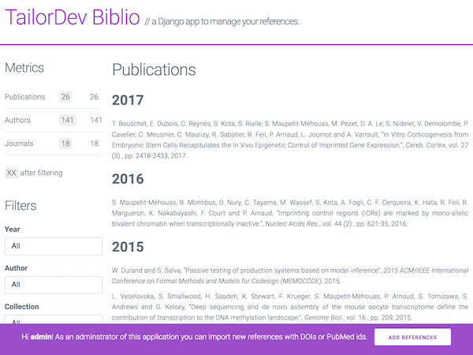

# Django TailorDev Biblio

Bibliography management with Django.

[
](https://travis-ci.org/TailorDev/django-tailordev-biblio/)
[](https://coveralls.io/github/TailorDev/django-tailordev-biblio?branch=master)
[](https://pypi.python.org/pypi/django-tailordev-biblio)

## Compatibility

Since the `1.0.0` release, we have added full support for recent python and
Django releases:

|            | Django 1.8         | Django 1.9         | Django 1.10        | Django 1.11        | Django 2.0         | Django 2.1         |
| ---------- | ------------------ | ------------------ | ------------------ | ------------------ | ------------------ | ------------------ |
| Python 2.7 | :heavy_check_mark: | :heavy_check_mark: | :heavy_check_mark: | :heavy_check_mark: |                    |                    |
| Python 3.4 | :heavy_check_mark: | :heavy_check_mark: | :heavy_check_mark: | :heavy_check_mark: | :heavy_check_mark: |                    |
| Python 3.5 | :heavy_check_mark: | :heavy_check_mark: | :heavy_check_mark: | :heavy_check_mark: | :heavy_check_mark: | :heavy_check_mark: |
| Python 3.6 | :heavy_check_mark: | :heavy_check_mark: | :heavy_check_mark: | :heavy_check_mark: | :heavy_check_mark: | :heavy_check_mark: |

Please note that for older Python and/or Django versions, you can still use the `0.3` release.

## Sandbox

Click on the screenshot below to browse the sandbox deployed on Heroku:

[

](https://tailordev-biblio.herokuapp.com)

_Nota bene:_ to test [references
importation](https://tailordev-biblio.herokuapp.com/import/) from PMIDs or DOIs,
you will need to login with these credentials:

```
login: rosalind
password: idiscovereddnastructurefirst
```

## Installation

### Install `td_biblio`

The easiest way to go is to use pip:

```bash
$ pip install -U django-tailordev-biblio
```

### Configure `td_biblio`

Add `td_biblio` to your `INSTALLED_APPS` in django settings:

```python
# foo_project/settings.py

INSTALLED_APPS = (
    # other apps…
    'td_biblio',
)
```

Add `td_biblio` urls your project url patterns:

```python
# foo_project/urls.py

urlpatterns = [
    # other urls…
    url(r'^bibliography/', include('td_biblio.urls', namespace='td_biblio')),
]
```

And finally migrate your database from your project root path:

```bash
$ python manage.py migrate td_biblio
```

### Add a base template

In order to use `td_biblio` templates, you will need to create a base template
to inherit from. This base template should be visible as `_layouts/base.html`
and contains at least the following blocks:

```html
<html>
  <head>
    <title>Publication list</title>
  </head>
  <body>
     
  </body>
</html>
```

As you might have guessed, the `content` block is the base block where we render
the bibliography list and item details, while the `javascripts` block contains
eponym front-end dependencies. You will find an example base layout template at:
[`td_biblio/templates/_layouts/base.html`](https://github.com/TailorDev/django-tailordev-biblio/blob/master/td_biblio/templates/_layouts/base.html)

## Import bibliography

Once `td_biblio` is installed and configured, you may want to import your
references stored in a BibTeX file. Hopefully, there is a command for that:

```bash
$ python manage.py bibtex_import my_bibliography.bib
```

Alternatively, you can browse to the `/import/` view with a superuser account
to fetch references from their DOIs or PMIDs.

## Hack

### Development installation

If you intend to work on the code, clone this repository and install all
dependencies in a virtual environment via:

```bash
$ make bootstrap
```

And then start the development server via:

```bash
$ make dev
```

### Running the Tests

You can run the tests with via:

```bash
$ make test
```

### Deploy to Heroku

To start playing with an Heroku instance, we suppose you have:

- an Heroku account;
- a functional SSH key imported for this account;
- installed the [`heroku` client](https://devcenter.heroku.com/articles/heroku-cli).

```bash
# Log in to heroku
$ heroku login

# Configure current repository as a registered heroku app
$ heroku git:remote -a tailordev-biblio

# Push your code
$ git push heroku master

# Perform database migrations
$ heroku run python sandbox/manage.py migrate
```

### Upload a new release to PyPI

```bash
$ python setup.py sdist bdist_wheel
$ twine upload dist/*
```

## License

`django-tailordev-biblio` is released under the MIT License. See the bundled
LICENSE file for details.
